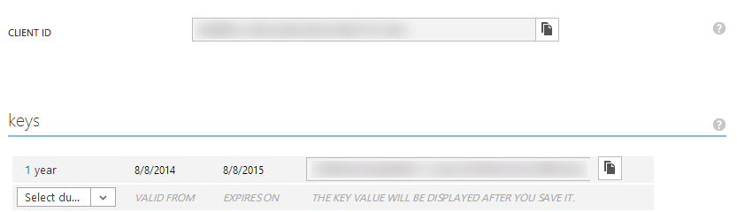

Expense Manager with AngularJS, SharePoint/Office 365 and Windows Azure Active Directory (WAAD)
===============

If you’re new to AngularJS check out the [AngularJS in 60-ish Minutes](http://weblogs.asp.net/dwahlin/video-tutorial-angularjs-fundamentals-in-60-ish-minutes) video tutorial or download the [free eBook](http://weblogs.asp.net/dwahlin/angularjs-in-60-ish-minutes-the-ebook). Also check out [The AngularJS Magazine](http://flip.it/bdyUX) for up-to-date information on using AngularJS to build Single Page Applications (SPAs).

This application is a stand-alone AngularJS application that performs CRUD operations against SharePoint/Office 365. Authentication relies on Windows Azure Active Directory (WAAD).
This application demonstrates:

* Consuming data provided by SharePoint/Office 365 RESTful APIs
* Authentication against Windows Azure Active Directory (WAAD)
* A custom "middle-man" proxy that allows cross-domain calls to be made to SharePoint/Office 365
* A complete application with read-only and editable data
* Using AngularJS with $http in a factory to access a backend RESTful service
* Techniques for showing multiple views of data (card view and list view)
* Custom filters for filtering customer and product data
* A custom directive to ensure unique values in a form for email 
* A custom directive that intercepts $http and jQuery XHR requests (in case either are used) and displays a loading dialog
* A custom directive that handles highlighting menu items automatically based upon the path navigated to by the user
* Form validation using AngularJS

#Prerequisites

* Azure subscription (trial will work)
* Office 365 tenant
* SharePoint site collection in your Office 365 tenant

#Office 365 and SharePoint Setup

1. Upload the ExpensesTrackerSiteTemplate.wsp template into an existing Office 365/SharePoint site collection solution folder. Then create a Site instance within that site collection based on that site template called "Expense Tracker Site Template". This will create an Expenses site with 3 lists for employees, expenses, and states.


#Azure and Application Setup
To get the application running you'll need to do the following:

1. Login to your Azure Management Portal and select Active Directory from the left menu.

    

1. Click on the directory you'd like to use (Default Directory will work fine)

    

1. Click the "Add an application you're developing" link
1. Give the application a name of Expense Manager:

    

1. Click the arrow to go to the next screen and enter the following for the information in the screen. Substitute your Office 365 Tenant ID for YOUR_TENANT: 

    

1. Press the Complete button in the wizard to create the application.
1. Click the CONFIGURE link at the top of the Expense Manager application screen.
1. Scroll to the "keys" section and select **1 year** from the dropdown.
1. Note the Client ID and key value that are displayed. You'll need to update the application's web.config file with these values in a moment.

    

1. Scroll down to the "permissions to other applications" section of the screen.
1. In the first dropdown in the Windows Azure Active Directory column select Office 365 SharePoint Online and make the selections shown next:

    

1. Click the Save icon at the bottom of the interface.
1. Open the Expense Manager's .sln file in Visual Studio 2013 or higher (click Download Zip in Github and extract the project if you haven't already)
1. Open web.config and replace ClientID and Password values with the ClientID and Key displayed in the Azure Directory screen shown earlier:

```html
    <add key="ida:ClientID" value="Your WAAD Application ClientID" />
    <add key="ida:Password" value="Your WAAD Application Password" />
```

1. Locate the SharePointResourceId and SharePointServiceRoot keys in web.config and update YOUR_TENANT with your Office 365 tenant ID.
1. Open index.html from the root of the project and scroll to the bottom.
1. Locate the expenseManager.baseSPUrl variable and update YOUR_TENANT with your Office 365 tenant ID. 
1. Press F5 to build and run the application. 
1. You should be taken to a login screen where you can login using your Office 365 credentials.